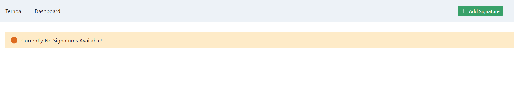
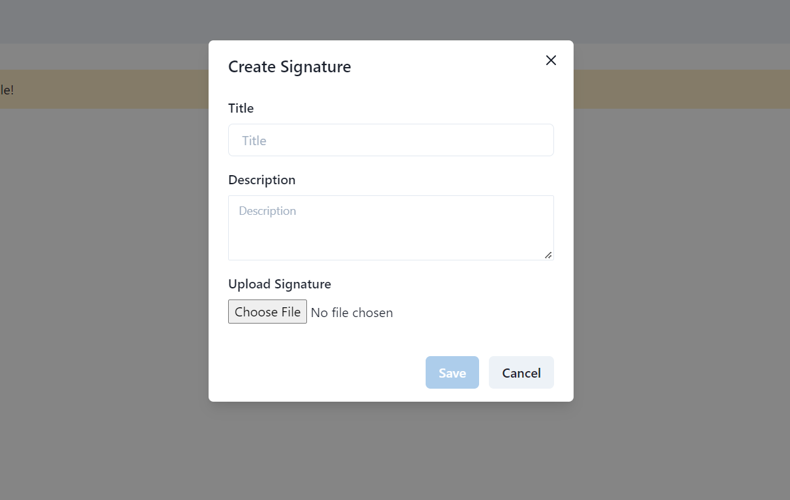
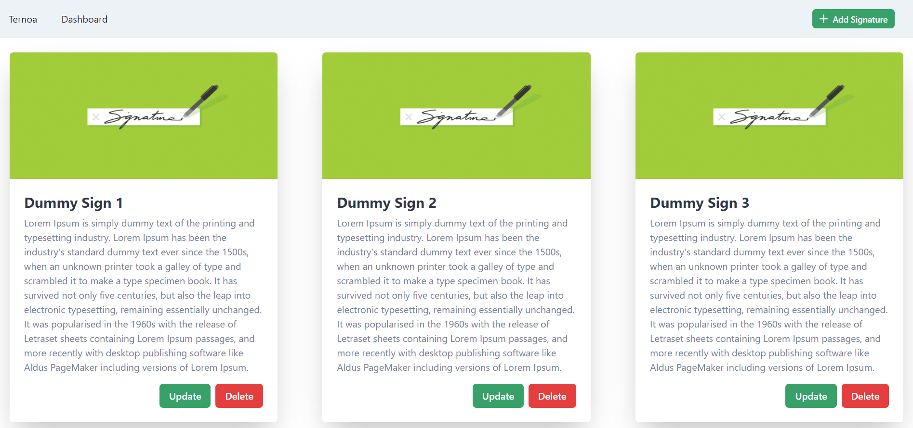
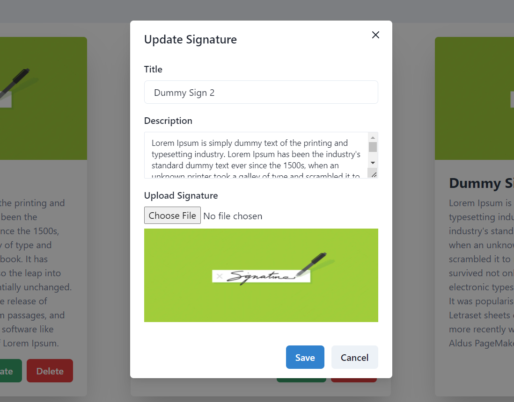

## Description

Technologies used:

 - Nodejs v14.19.0
 - Backend - [Nest](https://github.com/nestjs/nest) 
 - Frontend - [Next](https://nextjs.org/)
 - SQLite DB
 - ORM - [Prisma](https://www.prisma.io/docs/)
 - UI Lib - [Cakra-ui](https://chakra-ui.com/)

## Installation

```bash
$ yarn install
```

## Primsa Commands (Setup)

- To Setup Prisma Migration Client Generation for TypeScript

```bash

$ npx prisma migrate dev --name init
$ npx prisma generate

```

## Running the app

```bash
# development
$ npm run start

# watch mode
$ npm run start:dev

# production mode
$ npm run start:prod
```

## Test

```bash
# unit tests
$ npm run test

# e2e tests
$ npm run test:e2e

# test coverage
$ npm run test:cov
```

## Project Theme

- `Create`, `Delete`, `Update`, `List` Signatures of Celebrities.

## Screenshots (UI Output)

### Empty Signatures Message


### Add Signature


### List Signatures with update and delete buttons


### Update Signature Form (Reused the same component)


### Mobile View (Responsive Design)


## Highlights of the Project

- Fully `TypeScript` based project with all latest packages.
- Fully Functional `Next.js` Server Sider Rendering.
- Used `Nest.js` for Backend Framework which uses the best architecture and structure based on MVC.
- Clean Folder Structure to easily migratable to `Monorepo`.
- Used `Chakra UI` for better components and styling.
- Used `Prisma ORM` for best client library for TypeScript with easy utils like `Seeding`, `Type Gernerations` using CLI.
- Added clean trackable commits.

## Further Improvements

- Migrate the existing Image Upload Logic to AWS S3 or Image hosting Service.
- Unit Tests and `e2e` Tests.
- Migrate to Monorepo architecture.
- Add `MetaMask`
- Improve Client Service usage with fetch and create utils for `SSR`.
- Setup `.env` file for different deployments.
- Setup Github Actions for CI/CD.
- Setup `Changesets` for versioning.
- Setup infra scripts for deployment (`AWS SAML`).
- Improve ESLint & Prettier Configs.
- Create common `Shared Types`.

